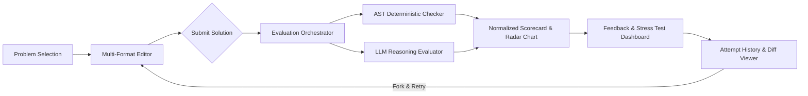

# Low-Level Design (LLD) Practice Platform: System & Domain Design Note

## 1. Executive Summary & MVP Scope

The **LLD Practice Platform** is a monolithic web application designed to help software engineers practice Low-Level Object-Oriented Design (LLD), submit multi-format solution artifacts, receive deterministic and LLM-assisted explainable feedback, and track design evolution across iterative attempts.

---

## 2. Core Learner Flow & User Experience



---

## 3. Domain Model Architecture & Responsibilities

The domain is built around clean object-oriented principles using TypeScript interfaces and decoupled classes:

### Core Domain Entities

```typescript
// 1. Problem & Rubric Definition
interface Problem {
  id: string;
  title: string;
  category: string;
  difficulty: 'Easy' | 'Medium' | 'Hard';
  prompt: string;
  expectedConcepts: string[];
  constraints: ProblemConstraint[];
  rubric: RubricCriterion[];
}

// 2. Submission & Parsed Representation
interface RawSubmission {
  formatId: 'code_outline' | 'mermaid_diagram' | 'json_design' | 'text';
  content: string;
}

interface ParsedSubmission {
  classes: ParsedClass[];
  relationships: ParsedRelationship[];
  notes?: string;
}

// 3. Evaluator Abstractions
interface ISubmissionFormat {
  id: SubmissionFormatId;
  parse(raw: RawSubmission): ParsedSubmission;
}

interface IEvaluator {
  id: string;
  type: 'deterministic' | 'llm';
  evaluate(input: EvaluationInput): Promise<EvaluatorOutput>;
}

// 4. Attempt & Evaluation Lifecycle
interface Attempt {
  id: string;
  problemId: string;
  attemptNumber: number;
  rawSubmission: RawSubmission;
  createdAt: string;
  status: 'pending' | 'running' | 'completed' | 'failed';
  evaluation?: EvaluationResult;
}
```

---

## 4. Evaluation Strategy: Deterministic vs. LLM

| Evaluation Layer | Mechanism | Scope / Objective |
| :--- | :--- | :--- |
| **AST Deterministic Evaluator** | Rule-backed AST & regex parser (`ClassOutlineParser`, `MermaidParser`) | Checks required domain concepts, presence of interfaces, absence of God Classes (>7 methods), and relationship cardinality. Fast, synchronous, 100% deterministic. |
| **LLM Subjective Evaluator** | OpenAI GPT-4o-mini API / Intelligent Built-in Fallback Engine | Evaluates Single Responsibility Principle (SRP) boundaries, trade-off depth, extensibility, and generates actionable remediation guidance. |
| **Evaluation Orchestrator** | Aggregator pattern combining deterministic (40%) and LLM (60%) scores | Computes normalized 5-dimensional Radar Scores (Abstraction, SOLID, Extensibility, Edge Cases, Trade-offs) and produces a unified verdict. |

---

## 5. Resilient Handling of Pending & Failed Evaluations

1. **In-Process Job Lifecycle**: Jobs transition from `pending` ➔ `running` ➔ `completed` / `failed`.
2. **Zero-Config Fallback**: If an external LLM API key is missing or fails due to network/rate-limiting errors, the system seamlessly transitions to the built-in intelligent heuristic engine without crashing or blocking the learner loop.
3. **Preservation of Attempts**: Attempts are stored immutably regardless of evaluation status so learners never lose work.

---

## 6. Key Trade-offs & Future Extensibility

- **Monolith vs. Microservices**: Kept as a clean in-memory/browser-persisted monolith to eliminate deployment overhead while retaining microservice-ready interface boundaries (`IEvaluator`, `ISubmissionFormat`).
- **Pluggable Formats**: Adding a new submission format (e.g., PlantUML or Python AST) requires implementing `ISubmissionFormat` without modifying UI or evaluation orchestrator logic.
